# Electronics E-Commerce Web Application (Full Stack)

<p align="center">
  
  
  
  
  
</p>

---

A production-style **Electronics E-Commerce Web Application** built using **React + Material UI** and **Spring Boot** secured with **JWT Authentication**. Implements a complete shopping workflow including **Cart**, **Checkout**, **Order Tracking**, and an advanced **Admin Order & Refund Management** system with **Stock Restoration Logic**.

---

## Table of Contents
- [Overview](#overview)
- [Key Features](#key-features)
  - [User Features](#user-features)
  - [Admin Features](#admin-features)
- [Tech Stack](#tech-stack)
  - [Frontend](#frontend)
  - [Backend](#backend)
- [Screenshots](#-screenshots)
- [Project Structure](#-project-structure)
- [Setup Instrutions](#️-setup-instructions)
  - [Backend Setup](#-backend-setup-spring-boot)
  - [Frontend Setup](#-frontend-setup-react)
- [Roles & Access](#-roles-and-access)
  - [User](#-user)
  - [Admin](#-admin)
- [Testing](#-testing)
-[Feature Enhancements](#-future-enhancements)
-[Project Status](#-project-status)
-[Hi](#hi)

---

## Overview
This application is designed to deliver a real-world e-commerce experience:

✅ Browse products and manage cart  
✅ Secure checkout and payment simulation  
✅ Place and track orders  
✅ Refund request workflow  
✅ Admin control panel for order status & refunds  
✅ Stock restoration logic on cancel/refund

---

## Key Features

### User Features
- JWT Authentication (Register / Login)
- Product listing with pagination
- Category filter and search
- Add to Cart, update quantity, remove items
- Checkout with shipping address validation
- Payment simulation and order placement
- Order history and order details page
- Refund request for delivered orders

### Admin Features
- View all customer orders
- Update order status (PROCESSING / SHIPPED / DELIVERED / CANCELLED)
- Refund request visibility & processing
- Refund status update (REFUND_INITIATED → REFUNDED)
- Stock restoration on cancel/refund
- Soft deleted products cannot be purchased

---

## Tech Stack

### Frontend
- React.js (**19.2.0**)
- Material UI (MUI) (**7.3.7**)
- React Router DOM (**7.12.0**)
- Axios (**1.13.2**)

### Backend
- Spring Boot (**3.5.10**)
- Spring Security (**Starter Managed**)
- JWT Authentication (JJWT **0.11.5**)
- Spring Data JPA (Hibernate) (**Starter Managed**)

### Database
- MySQL

---

## 📂 Project Structure

```bash
ecommerce-project/
├── ecommerce-frontend/     # React + MUI Frontend
├── ecommerce-backend/      # Spring Boot Backend
├── screenshots/            # Project Screenshots
└── README.md               # Main Documentation
```
---

## 🖼 Screenshots

### 🛠 User Pages

#### 🏠 Products Page
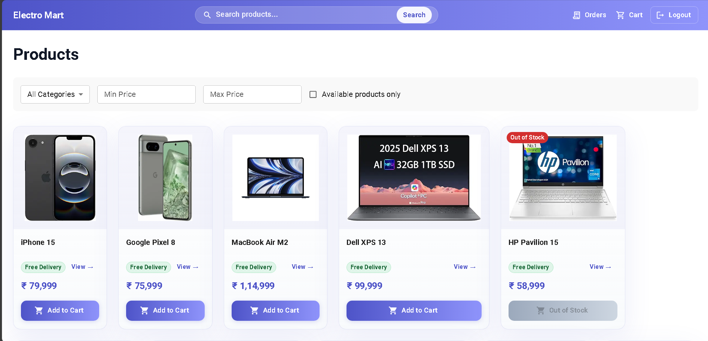

#### 🔎 Product Details Page
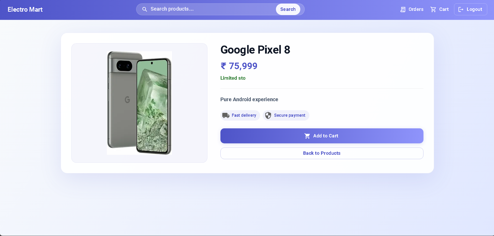

#### 🛒 Cart Page
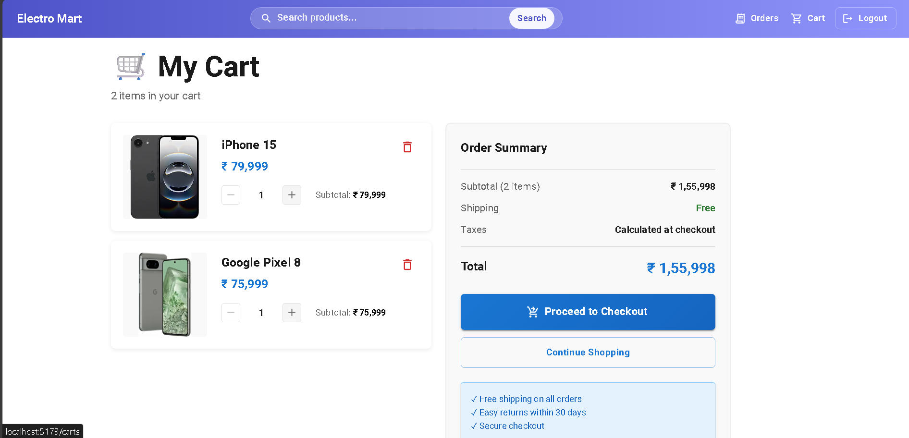

#### 📍 Checkout Page
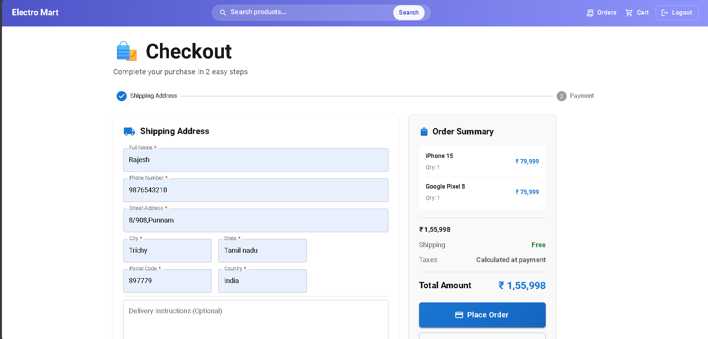

#### 💳 Payment Page
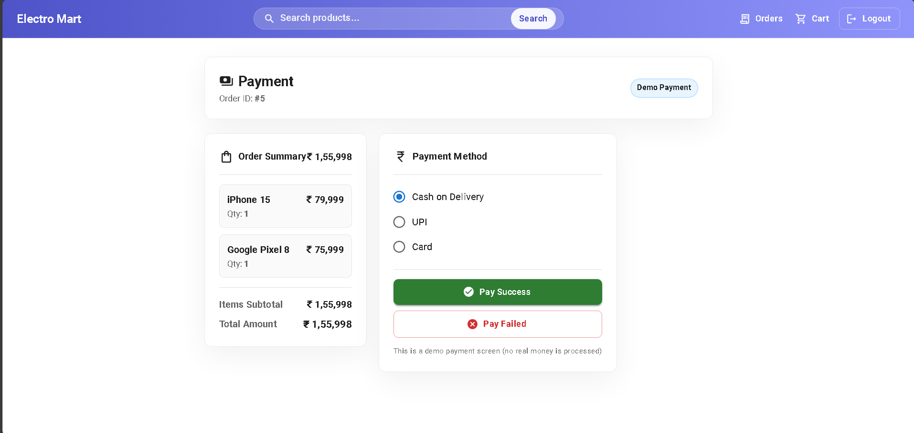

#### 📦 Orders Page
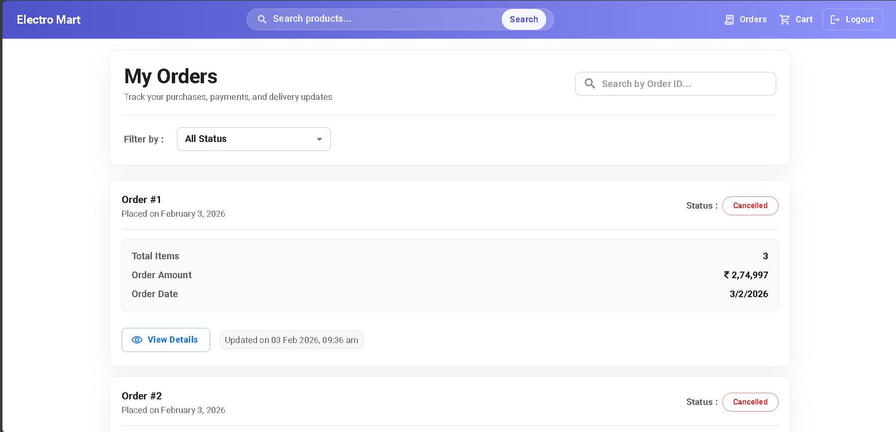

#### 📄 Order Details Page
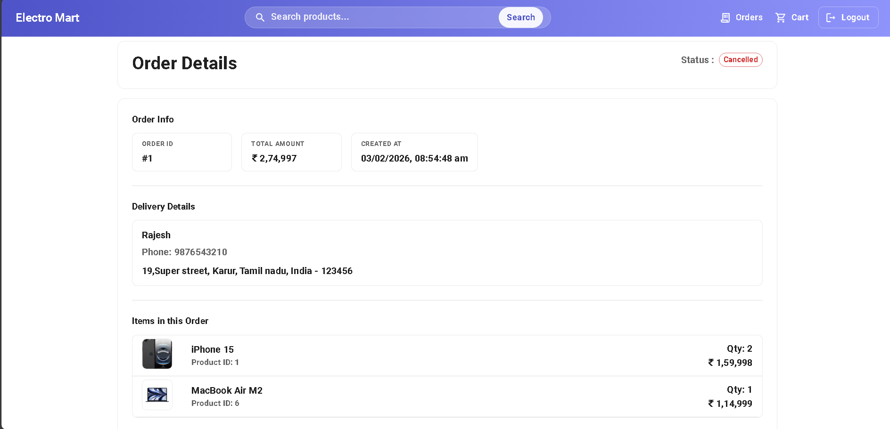

---

### 🛠 Admin Pages

#### 🔨 Admin Page
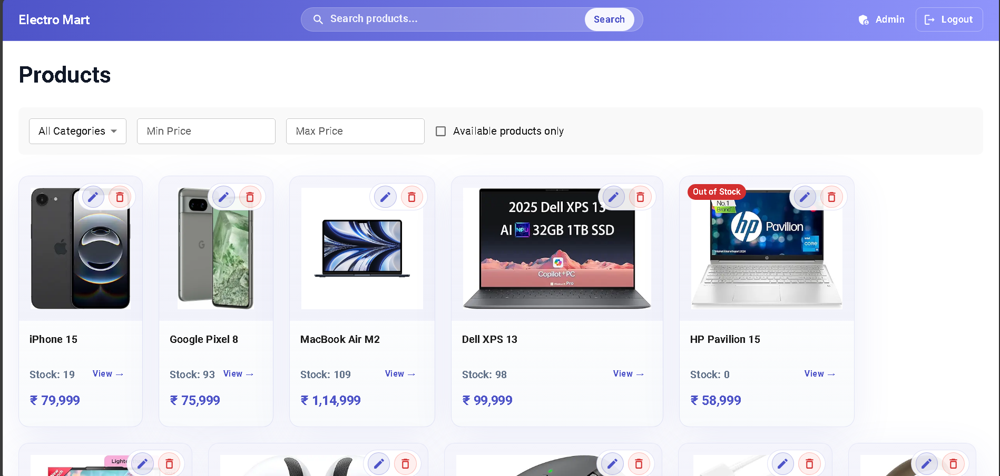

#### 📊 Admin Orders Dashboard
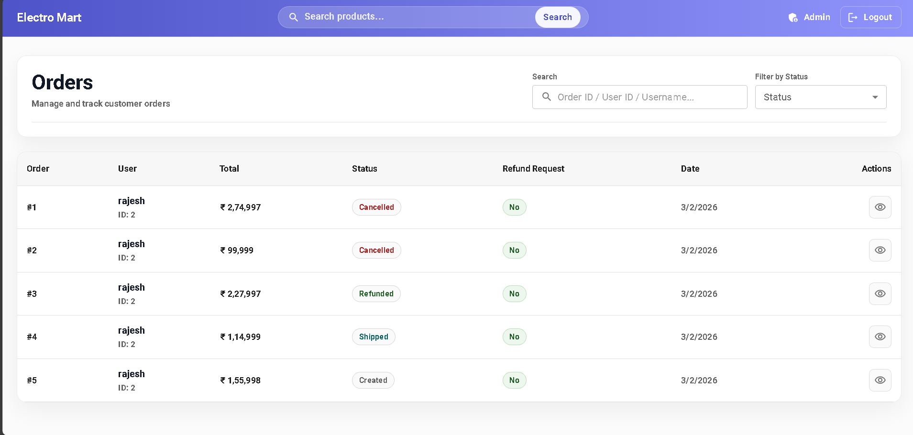

#### ✅ Admin Order Details
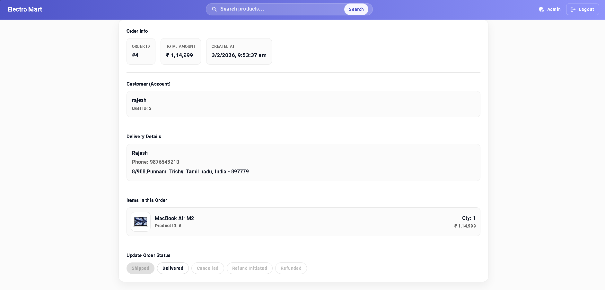

#### 🔨 Admin Product Create
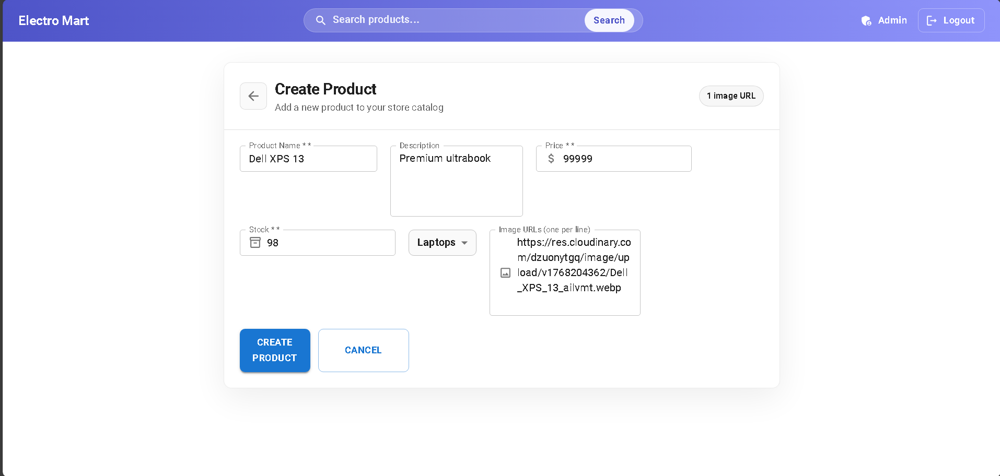

#### 🔨 Admin Product Update
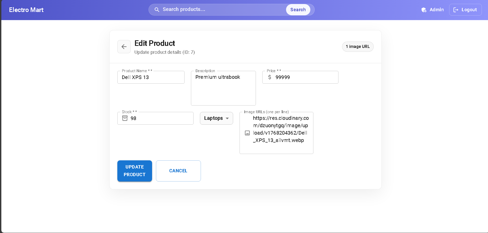

---

### Sign In / Sign Up Pages

#### 📋 Login Page
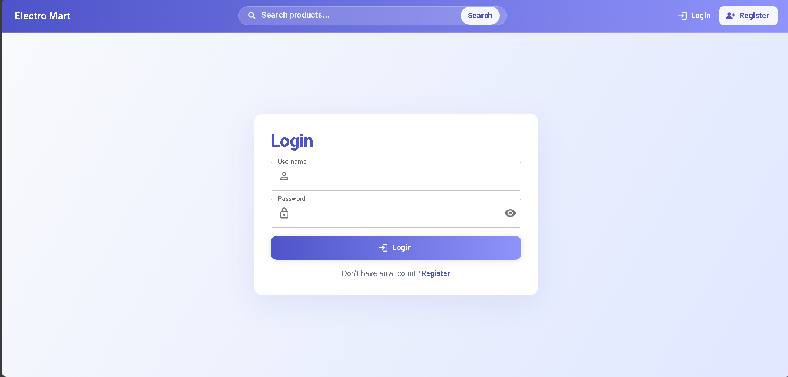

#### 📋 Register Page
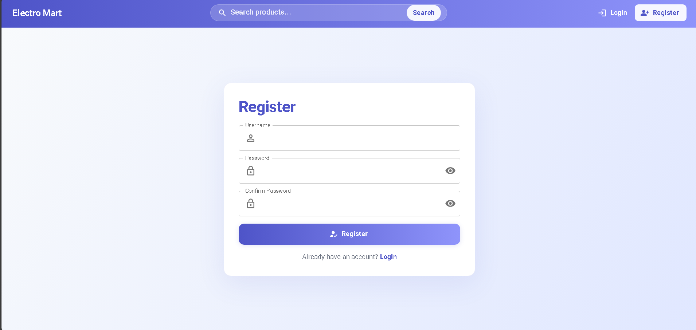

---

## ⚙️ Setup Instructions

### ✅ Backend Setup (Spring Boot)

1. Move into backend folder:
```bash
cd ecommerce-backend
```

2. Configure MySQL in: src/main/resources/application.properties
```bash
src/main/resources/application.properties

Example:

spring.datasource.url=jdbc:mysql://localhost:3306/ecommerce_db
spring.datasource.username=root
spring.datasource.password=your_password

spring.jpa.hibernate.ddl-auto=update
spring.jpa.show-sql=true
```

3.Start backend:

```bash
mvn spring-boot:run
```

4.✅ Backend runs on:
  
http://localhost:8080


### ✅ Frontend Setup (React)

1. Move into frontend folder:
```bash
cd ecommerce-frontend
```

2. Install dependencies:
```bash
npm install
```

3. Start frontend:
```bash
npm run dev
```

4. Frontend runs on:

http://localhost:5173

---

## 🔐 ROLES AND ACCESS

### 👤 USER

- Browse products with search, filters, and pagination
- Add/remove items from cart and update quantities
- Secure checkout and place orders
- Track order status and view order details
- Request refunds for delivered orders

---

### 🛠 ADMIN

- View and manage all customer orders
- Update order status (Placed → Shipped → Delivered)
- Process refund requests and update refund status

---

## 🧪 Testing

- All features were manually tested for end-to-end functionality:
- Auth: Login/Register token persistence.
- Flow: Cart -> Checkout -> Order placement.
- Admin: Order status transition and refund lifecycle.
- Database: Stock restoration verified in MySQL after refunds.

---

## 🚀 Future Enhancements

- Online payment gateway integration (Razorpay / Stripe)
- Product reviews and ratings
- Admin analytics dashboard
- Email notifications (Order placed / shipped / delivered)

---

## 📌 Project Status

✅ Active Development / Improving UI & Features

---

##  Hi

Developed by Ranjith A 🚀

---

